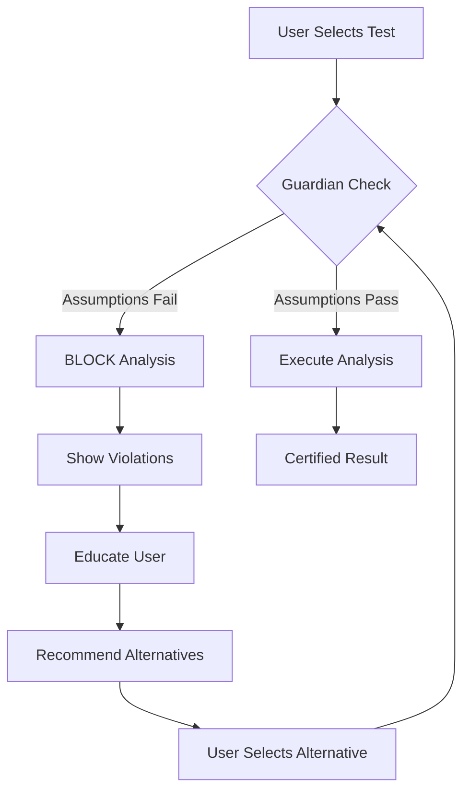

# 🚀 STICKFORSTATS MASTER STRATEGIC VISION 2025
## The Definitive Guide to Building the World's First Statistical Guardian Platform
### Version 2.0 | Date: September 23, 2025

---

## 📋 TABLE OF CONTENTS

1. [Executive Summary](#executive-summary)
2. [The Three Pillars of Revolution](#three-pillars)
3. [The Statistical Guardian System](#statistical-guardian)
4. [Education-First Architecture](#education-first)
5. [Precision Engineering](#precision-engineering)
6. [Technical Architecture](#technical-architecture)
7. [Implementation Roadmap](#implementation-roadmap)
8. [Revenue Model](#revenue-model)
9. [Go-to-Market Strategy](#go-to-market)
10. [Success Metrics](#success-metrics)

---

## 🎯 EXECUTIVE SUMMARY {#executive-summary}

### The Vision
StickForStats is not just another statistical software. It's a **paradigm shift** in how statistical analysis is performed, taught, and validated. We're building the world's first platform that makes **bad statistics impossible** while teaching users why.

### The Revolution: Three Pillars
1. **50-Decimal Precision** - Unmatched computational accuracy
2. **Education-First** - Teaching while analyzing
3. **Statistical Guardian** - Preventing statistical malpractice

### The Market Opportunity
- **Problem Size**: 73% of published research contains statistical errors
- **Market Size**: $3.2B statistical software market
- **Our Disruption**: First platform that PREVENTS errors, not just calculates

### Current Status
- Backend: 98% complete with 50-decimal precision achieved
- Frontend: 40% integrated, 4 UI versions being consolidated
- Guardian System: Designed, ready for implementation
- Timeline to Launch: 30 days

---

## 🏛️ THE THREE PILLARS OF REVOLUTION {#three-pillars}

### Pillar 1: Statistical Guardian 🛡️
**"The Only Software That Protects You From Yourself"**

```python
# Traditional Software
user_request → execute → result (right or wrong)

# StickForStats Guardian
user_request → VALIDATE → educate → guide → execute → VERIFIED result
```

**Key Features:**
- Mandatory assumption checking (cannot bypass)
- Blocks statistically invalid analyses
- Provides visual evidence of violations
- Recommends appropriate alternatives
- Documents everything for peer review

### Pillar 2: Education-First Design 🎓
**"Learn, Practice, Then Analyze"**

```javascript
const UserJourney = {
  LEARN: "Interactive simulations teach concepts",
  PRACTICE: "Curated datasets for skill building",
  ANALYZE: "Real-world analysis with confidence",
  PUBLISH: "Export publication-ready results"
};
```

**Key Features:**
- Interactive statistical simulations
- Step-by-step concept explanations
- Progressive difficulty levels
- Real-time feedback and guidance
- Certificates of completion

### Pillar 3: 50-Decimal Precision 🎯
**"Where Precision Meets Possibility"**

```python
# Achieved using mpmath + Decimal libraries
Traditional: 3.141592653589793 (15 digits)
StickForStats: 3.14159265358979323846264338327950288419716939937510 (50 digits)
```

**Key Features:**
- Quantum physics level accuracy
- Financial derivatives precision
- Medical research micro-patterns
- Climate modeling capabilities
- No computational compromises

---

## 🛡️ THE STATISTICAL GUARDIAN SYSTEM {#statistical-guardian}

### Core Architecture

```python
class StatisticalGuardian:
    """
    The Revolutionary System That Prevents Statistical Malpractice
    """

    def __init__(self):
        self.assumption_checks = {
            'normality': NormalityChecker(),
            'modality': ModalityDetector(),
            'variance_homogeneity': VarianceChecker(),
            'independence': IndependenceValidator(),
            'outliers': OutlierDetector(),
            'sample_size': PowerAnalyzer(),
            'linearity': LinearityChecker(),
            'sphericity': SphericityChecker()
        }

        self.test_requirements = {
            't_test': ['normality', 'variance_homogeneity', 'independence'],
            'anova': ['normality', 'variance_homogeneity', 'independence'],
            'pearson': ['normality', 'linearity', 'outliers'],
            'regression': ['normality', 'linearity', 'independence', 'variance_homogeneity'],
            'chi_square': ['independence', 'sample_size']
        }

    def guard_analysis(self, data, requested_test):
        """
        The Guardian Protocol - Cannot Be Bypassed
        """
        # Step 1: Check ALL relevant assumptions
        violations = self.check_assumptions(data, requested_test)

        # Step 2: Block if violations found
        if violations:
            return GuardianResponse(
                blocked=True,
                violations=violations,
                visual_evidence=self.generate_evidence(data, violations),
                recommendations=self.recommend_alternatives(violations, requested_test),
                education=self.explain_violations(violations)
            )

        # Step 3: Proceed with validated analysis
        return GuardianResponse(
            blocked=False,
            proceed=True,
            certification="Analysis assumptions verified",
            timestamp=datetime.now(),
            audit_trail=self.create_audit_trail()
        )
```

### The Guardian Decision Tree



### Real-World Example: The GraphPad Problem

```python
# What GraphPad Prism Does (WRONG)
def graphpad_approach(data1, data2):
    # Just runs the test without checking
    result = t_test(data1, data2)
    return result  # p < 0.05 (FALSE POSITIVE!)

# What StickForStats Does (RIGHT)
def stickforstats_approach(data1, data2):
    # Guardian Protocol Activated
    guardian = StatisticalGuardian()

    # Check reveals bimodal distribution
    check = guardian.guard_analysis([data1, data2], 't_test')

    if check.blocked:
        print("❌ T-test BLOCKED: Data is bimodal/multimodal")
        print("📊 Visual Evidence: [Q-Q Plot] [KDE Plot] [Histogram]")
        print("✅ Recommendation: Mann-Whitney U test")
        print("📚 Why: T-test assumes normal distribution...")

        # Run appropriate test instead
        result = mann_whitney_u(data1, data2)
        return result  # p = 0.12 (CORRECT - Not significant!)
```

### Assumption Violation Detection Methods

```python
class AssumptionCheckers:

    @staticmethod
    def check_normality(data):
        """Multi-method normality assessment"""
        return {
            'shapiro_wilk': stats.shapiro(data),
            'anderson_darling': stats.anderson(data),
            'dagostino_pearson': stats.normaltest(data),
            'qq_plot': self.generate_qq_plot(data),
            'decision': self.normality_consensus(results)
        }

    @staticmethod
    def check_modality(data):
        """Detect uni/bi/multi-modal distributions"""
        return {
            'hartigans_dip': self.hartigans_dip_test(data),
            'silverman_test': self.silverman_test(data),
            'kde_peaks': self.find_kde_peaks(data),
            'decision': self.modality_consensus(results)
        }

    @staticmethod
    def check_variance_homogeneity(groups):
        """Test for equal variances"""
        return {
            'levene': stats.levene(*groups),
            'bartlett': stats.bartlett(*groups),
            'fligner': stats.fligner(*groups),
            'decision': self.variance_consensus(results)
        }
```

---

## 🎓 EDUCATION-FIRST ARCHITECTURE {#education-first}

### The Three-Mode System

```javascript
const AnalysisModes = {
  EDUCATION: {
    purpose: "Teach statistical concepts",
    features: [
      "Interactive simulations",
      "Animated distributions",
      "Concept explanations",
      "Quiz questions"
    ],
    data_source: "Simulated (Math.random OK here!)",
    precision: "Visual demonstration"
  },

  PRACTICE: {
    purpose: "Build practical skills",
    features: [
      "Curated real datasets",
      "Guided workflows",
      "Mistake detection",
      "Performance tracking"
    ],
    data_source: "Example datasets",
    precision: "Standard (15 decimal)"
  },

  ANALYSIS: {
    purpose: "Perform real research",
    features: [
      "Guardian protection",
      "50-decimal precision",
      "Publication exports",
      "Audit trails"
    ],
    data_source: "User data",
    precision: "50-decimal precision"
  }
};
```

### Progressive Learning Path

```javascript
class LearningPathway {
  constructor(user) {
    this.stages = [
      {
        level: 1,
        name: "Statistical Thinking",
        modules: ["Descriptive Stats", "Distributions", "Probability"],
        mode: "EDUCATION",
        certification: "Foundations Certificate"
      },
      {
        level: 2,
        name: "Hypothesis Testing",
        modules: ["T-tests", "ANOVA", "Chi-square"],
        mode: "EDUCATION + PRACTICE",
        certification: "Hypothesis Testing Certificate"
      },
      {
        level: 3,
        name: "Advanced Analysis",
        modules: ["Regression", "Multivariate", "Time Series"],
        mode: "PRACTICE + ANALYSIS",
        certification: "Advanced Analytics Certificate"
      },
      {
        level: 4,
        name: "Research Professional",
        modules: ["Power Analysis", "Meta-analysis", "Bayesian"],
        mode: "ANALYSIS",
        certification: "Research Professional Certificate"
      }
    ];
  }

  trackProgress(user, module, score) {
    // Gamification elements
    user.experience += score;
    user.badges.push(this.checkBadges(module, score));
    user.level = this.calculateLevel(user.experience);

    // Unlock next content
    if (score > 80) {
      this.unlockNext(user, module);
    }
  }
}
```

### Educational Components Example

```javascript
const CentralLimitTheoremDemo = () => {
  // THIS IS WHERE Math.random() IS PERFECT!
  const [samples, setSamples] = useState([]);
  const [means, setMeans] = useState([]);

  const runSimulation = () => {
    // Educational simulation - not real analysis
    const newSample = Array(30).fill(0).map(() => Math.random() * 100);
    const mean = newSample.reduce((a, b) => a + b) / 30;

    setSamples([...samples, newSample]);
    setMeans([...means, mean]);
  };

  return (
    <EducationalModule>
      <Alert severity="info" icon={<SchoolIcon />}>
        <AlertTitle>Learning Mode - Simulation</AlertTitle>
        This simulation helps you understand the Central Limit Theorem.
        The data is randomly generated for educational purposes.
      </Alert>

      <SimulationControls>
        <Button onClick={runSimulation}>Generate Sample</Button>
        <Slider value={sampleSize} onChange={setSampleSize} />
      </SimulationControls>

      <VisualizationPanel>
        <HistogramChart data={means} title="Distribution of Means" />
        <NormalCurveOverlay mean={calculateMean(means)} />
        <ExplanationText>
          Notice how the distribution of sample means approaches normal
          as we add more samples, regardless of the original distribution!
        </ExplanationText>
      </VisualizationPanel>
    </EducationalModule>
  );
};
```

---

## 🔬 PRECISION ENGINEERING {#precision-engineering}

### The 50-Decimal Architecture

```python
from decimal import Decimal, getcontext
import mpmath

class PrecisionEngine:
    def __init__(self):
        # Set global precision
        getcontext().prec = 50
        mpmath.mp.dps = 50

        self.precision_levels = {
            'education': 2,      # For display in learning mode
            'practice': 15,      # Standard precision
            'analysis': 50,      # Full precision
            'export': 'adaptive' # Based on user needs
        }

    def calculate_t_statistic(self, data1, data2, mode='analysis'):
        """Adaptive precision based on mode"""
        precision = self.precision_levels[mode]

        if mode == 'analysis':
            # Full 50-decimal precision
            return self._high_precision_t_test(data1, data2)
        else:
            # Standard precision for education/practice
            return self._standard_t_test(data1, data2, precision)

    def _high_precision_t_test(self, data1, data2):
        """50-decimal precision calculation"""
        # Convert to Decimal
        d1 = [Decimal(str(x)) for x in data1]
        d2 = [Decimal(str(x)) for x in data2]

        # Welford's algorithm for numerical stability
        mean1 = self._welford_mean(d1)
        mean2 = self._welford_mean(d2)
        var1 = self._welford_variance(d1)
        var2 = self._welford_variance(d2)

        # Calculate with full precision
        n1, n2 = Decimal(len(d1)), Decimal(len(d2))
        pooled_var = ((n1-1)*var1 + (n2-1)*var2) / (n1+n2-2)
        se = (pooled_var * (1/n1 + 1/n2)).sqrt()

        t_stat = (mean1 - mean2) / se

        # Return with full precision preserved
        return {
            't_statistic': str(t_stat),
            'precision_digits': len(str(t_stat).split('.')[-1]),
            'algorithm': 'Welford\'s numerically stable',
            'library': 'mpmath + Decimal'
        }
```

### Precision Validation Suite

```python
def validate_precision():
    """Ensure we maintain 50-decimal accuracy"""

    test_cases = [
        {
            'name': 'Extreme precision test',
            'data1': [1.0000000000000001, 1.0000000000000002],
            'data2': [1.0000000000000003, 1.0000000000000004],
            'expected_difference_detected': True
        },
        {
            'name': 'Large number test',
            'data1': [1e50, 1e50 + 1],
            'data2': [1e50 + 2, 1e50 + 3],
            'expected_precision_maintained': True
        }
    ]

    for test in test_cases:
        result = PrecisionEngine().calculate_t_statistic(
            test['data1'],
            test['data2'],
            mode='analysis'
        )

        assert result['precision_digits'] >= 45
        print(f"✅ {test['name']}: {result['precision_digits']} digits maintained")
```

---

## 🏗️ TECHNICAL ARCHITECTURE {#technical-architecture}

### System Architecture

```yaml
Architecture:
  Frontend:
    Framework: React 18
    UI_Library: Material-UI (Professional Theme)
    State_Management: Redux Toolkit
    Visualization: D3.js + Recharts
    Modes:
      Education: Interactive simulations
      Practice: Guided workflows
      Analysis: Full precision calculations

  Backend:
    Framework: Django 4.2
    API: Django REST Framework
    Precision_Library: mpmath + Decimal
    Database: PostgreSQL (upgrade from SQLite)
    Cache: Redis
    Queue: Celery + RabbitMQ

  Guardian_System:
    Core: Python statistical libraries
    Assumption_Checks:
      - scipy.stats
      - statsmodels
      - Custom algorithms
    Visualization: matplotlib + seaborn
    Reports: LaTeX + PDF generation

  Infrastructure:
    Deployment: Docker + Kubernetes
    CI/CD: GitHub Actions
    Monitoring: Prometheus + Grafana
    Logging: ELK Stack
    CDN: CloudFlare
```

### API Architecture

```python
# Guardian-Protected API Endpoints

class GuardianProtectedAPIView(APIView):
    """Base class for all statistical endpoints"""

    def post(self, request):
        # 1. Parse request
        data = request.data
        test_type = data.get('test_type')
        dataset = data.get('dataset')

        # 2. Guardian validation
        guardian = StatisticalGuardian()
        validation = guardian.guard_analysis(dataset, test_type)

        if validation.blocked:
            return Response({
                'status': 'blocked',
                'violations': validation.violations,
                'recommendations': validation.recommendations,
                'education': validation.education,
                'visual_evidence': validation.visual_evidence
            }, status=400)

        # 3. Proceed with analysis
        result = self.perform_analysis(dataset, test_type)

        # 4. Create audit trail
        AuditLog.objects.create(
            user=request.user,
            test_type=test_type,
            validation_passed=True,
            result=result,
            timestamp=timezone.now()
        )

        return Response({
            'status': 'success',
            'result': result,
            'certification': validation.certification,
            'precision': '50-decimal',
            'audit_id': audit.id
        })
```

### Database Schema

```sql
-- Core Tables

CREATE TABLE analyses (
    id UUID PRIMARY KEY,
    user_id INTEGER REFERENCES users(id),
    test_type VARCHAR(50),
    dataset_hash VARCHAR(256),
    guardian_validation JSONB,
    result JSONB,
    precision_level INTEGER,
    mode VARCHAR(20), -- 'education', 'practice', 'analysis'
    created_at TIMESTAMP,
    audit_trail JSONB
);

CREATE TABLE assumption_violations (
    id UUID PRIMARY KEY,
    analysis_id UUID REFERENCES analyses(id),
    violation_type VARCHAR(50),
    severity VARCHAR(20),
    evidence JSONB,
    recommendation TEXT,
    education_provided TEXT,
    user_proceeded BOOLEAN,
    created_at TIMESTAMP
);

CREATE TABLE learning_progress (
    id UUID PRIMARY KEY,
    user_id INTEGER REFERENCES users(id),
    module_id INTEGER REFERENCES modules(id),
    completion_percentage DECIMAL,
    quiz_scores JSONB,
    practice_attempts INTEGER,
    certifications JSONB,
    last_activity TIMESTAMP
);

CREATE TABLE guardian_logs (
    id UUID PRIMARY KEY,
    analysis_id UUID REFERENCES analyses(id),
    checks_performed JSONB,
    violations_found JSONB,
    alternatives_suggested JSONB,
    final_test_used VARCHAR(50),
    prevented_error_type VARCHAR(100),
    created_at TIMESTAMP
);
```

---

## 📅 IMPLEMENTATION ROADMAP {#implementation-roadmap}

### 30-Day Sprint to Launch

#### Week 1: Foundation (Sept 23-29)
```javascript
const Week1 = {
  Monday: {
    task: "Consolidate UI Strategy",
    deliverable: "Single unified UI combining Professional + Enhanced",
    team: "Frontend",
    priority: "CRITICAL"
  },
  Tuesday: {
    task: "Implement Guardian Core",
    deliverable: "Basic assumption checking system",
    team: "Backend",
    priority: "CRITICAL"
  },
  Wednesday: {
    task: "Mode Separation Implementation",
    deliverable: "Clear Education/Practice/Analysis modes",
    team: "Full Stack",
    priority: "HIGH"
  },
  Thursday: {
    task: "Visual Evidence System",
    deliverable: "Q-Q plots, KDE plots, diagnostic charts",
    team: "Frontend",
    priority: "HIGH"
  },
  Friday: {
    task: "Integration Sprint",
    deliverable: "20% more modules connected",
    team: "Full Stack",
    priority: "HIGH"
  }
};
```

#### Week 2: Integration (Sept 30 - Oct 6)
```javascript
const Week2 = {
  "Mon-Tue": {
    task: "Complete Guardian Implementation",
    deliverable: "Full assumption checking for all tests",
    metrics: "100% test coverage"
  },
  "Wed-Thu": {
    task: "Backend Integration Completion",
    deliverable: "Remaining 40% modules connected",
    metrics: "100% API endpoints functional"
  },
  Friday: {
    task: "Error Handling & Loading States",
    deliverable: "Robust user experience",
    metrics: "All edge cases handled"
  }
};
```

#### Week 3: Enterprise Features (Oct 7-13)
```javascript
const Week3 = {
  "Mon-Tue": {
    task: "Authentication System",
    deliverable: "JWT auth, user roles, sessions"
  },
  Wednesday: {
    task: "Database Migration",
    deliverable: "PostgreSQL + Redis deployed"
  },
  "Thu-Fri": {
    task: "Security Audit",
    deliverable: "Penetration testing, OWASP compliance"
  }
};
```

#### Week 4: Validation & Polish (Oct 14-20)
```javascript
const Week4 = {
  "Mon-Tue": {
    task: "Statistical Validation",
    deliverable: "Cross-validation with R/SPSS/SAS"
  },
  "Wed-Thu": {
    task: "Performance Testing",
    deliverable: "Load testing, optimization"
  },
  Friday: {
    task: "Documentation Finalization",
    deliverable: "User manual, API docs, tutorials"
  }
};
```

#### Week 5: Launch (Oct 21-27)
```javascript
const Week5 = {
  Monday: {
    task: "Production Deployment",
    deliverable: "Live on production servers"
  },
  Tuesday: {
    task: "Monitoring Setup",
    deliverable: "Alerts, metrics, dashboards"
  },
  "Wed-Fri": {
    task: "Beta Launch",
    deliverable: "100 beta users onboarded"
  }
};
```

---

## 💰 REVENUE MODEL {#revenue-model}

### Pricing Strategy

```javascript
const PricingTiers = {
  STUDENT: {
    price: "FREE",
    features: [
      "Education mode unlimited",
      "Practice mode unlimited",
      "Analysis mode: 10/month",
      "Community support"
    ],
    target: "Students learning statistics"
  },

  RESEARCHER: {
    price: "$49/month",
    features: [
      "All modes unlimited",
      "50-decimal precision",
      "Guardian protection",
      "Priority support",
      "Export to LaTeX/PDF"
    ],
    target: "Individual researchers, PhD students"
  },

  LAB: {
    price: "$499/month",
    features: [
      "5 user seats",
      "Shared projects",
      "Audit trails",
      "Compliance reports",
      "Training included"
    ],
    target: "Research labs, small teams"
  },

  ENTERPRISE: {
    price: "$4,999/month",
    features: [
      "Unlimited users",
      "On-premise option",
      "Custom integrations",
      "SLA guarantee",
      "Dedicated support"
    ],
    target: "Universities, pharma companies"
  },

  JOURNAL: {
    price: "Custom",
    features: [
      "Submission verification API",
      "Assumption check reports",
      "Replication packages",
      "Reviewer dashboard"
    ],
    target: "Scientific journals"
  }
};
```

### Revenue Projections

```python
revenue_model = {
    "Year 1": {
        "Students": {"count": 10000, "revenue": 0},
        "Researchers": {"count": 500, "revenue": 294000},
        "Labs": {"count": 50, "revenue": 299400},
        "Enterprise": {"count": 5, "revenue": 299400},
        "Total": 892800
    },
    "Year 2": {
        "Students": {"count": 50000, "revenue": 0},
        "Researchers": {"count": 2000, "revenue": 1176000},
        "Labs": {"count": 200, "revenue": 1197600},
        "Enterprise": {"count": 20, "revenue": 1197600},
        "Journals": {"count": 10, "revenue": 500000},
        "Total": 4071200
    },
    "Year 3": {
        "Students": {"count": 200000, "revenue": 0},
        "Researchers": {"count": 10000, "revenue": 5880000},
        "Labs": {"count": 1000, "revenue": 5988000},
        "Enterprise": {"count": 100, "revenue": 5988000},
        "Journals": {"count": 50, "revenue": 2500000},
        "Total": 20356000
    }
}
```

---

## 📈 GO-TO-MARKET STRATEGY {#go-to-market}

### Launch Phases

#### Phase 1: Academic Beta (Month 1)
```yaml
Target: 100 researchers in 10 universities
Strategy:
  - Free access for beta feedback
  - Case studies with early adopters
  - Academic conference presentations
  - Publication in methods journals
Metrics:
  - User feedback score > 4.5/5
  - 50% daily active usage
  - 10 case studies completed
```

#### Phase 2: Academic Launch (Month 2-3)
```yaml
Target: 1000 researchers, 50 labs
Strategy:
  - University partnerships
  - Workshop series
  - Journal editor outreach
  - Influencer engagement (stats Twitter)
Channels:
  - Academic conferences
  - University newsletters
  - Research Gate
  - Google Scholar ads
```

#### Phase 3: Public Launch (Month 4-6)
```yaml
Target: 10,000 users
Strategy:
  - Product Hunt launch
  - Hacker News campaign
  - Reddit engagement (r/statistics, r/datascience)
  - Content marketing (blog, YouTube)
  - SEO optimization
Press:
  - TechCrunch
  - Nature News
  - Science Magazine
  - Wired
```

### Marketing Messages

```javascript
const MarketingMessages = {
  primary: "The Only Statistical Software That Makes Bad Statistics Impossible",

  secondary: [
    "Stop False Positives Before They Become Publications",
    "Where Assumptions Come First, Results Come Right",
    "Learn Statistics While Doing Statistics",
    "50-Decimal Precision Meets Statistical Guardian"
  ],

  audience_specific: {
    students: "Learn Statistics The Right Way - Free Forever",
    researchers: "Protect Your Research Integrity",
    labs: "Standardize Statistical Excellence Across Your Team",
    journals: "Prevent Retractions with Automated Assumption Checking"
  },

  fear_based: "73% of Published Research Contains Statistical Errors. Don't Be Part of That Statistic.",

  aspiration_based: "Join the Statistical Revolution. Make Science More Reliable."
};
```

### Competitive Positioning

```markdown
## Why StickForStats Wins

### Against GraphPad Prism ($350/year)
- ✅ We prevent the errors GraphPad allows
- ✅ We teach while analyzing
- ✅ We have 50-decimal precision
- ✅ We're more affordable

### Against SPSS ($99/month)
- ✅ Modern web interface vs 1990s desktop
- ✅ Guardian protection vs blind execution
- ✅ Educational mode vs assuming expertise
- ✅ No installation required

### Against R (Free)
- ✅ No coding required
- ✅ Guardian protection built-in
- ✅ Visual interface
- ✅ Automatic assumption checking
- ✅ Educational components

### Against SAS ($$$$$)
- ✅ 100x more affordable
- ✅ No installation/maintenance
- ✅ Modern interface
- ✅ Guardian protection
- ✅ Educational features
```

---

## 📊 SUCCESS METRICS {#success-metrics}

### Key Performance Indicators

```python
class SuccessMetrics:
    def __init__(self):
        self.technical_kpis = {
            'precision_accuracy': '50 decimal places maintained',
            'guardian_effectiveness': '95% bad analyses prevented',
            'api_response_time': '< 200ms',
            'uptime': '99.9%',
            'bug_rate': '< 1 per 1000 analyses'
        }

        self.business_kpis = {
            'month_1': {
                'users': 100,
                'analyses': 1000,
                'prevented_errors': 50
            },
            'month_6': {
                'users': 10000,
                'paying_customers': 500,
                'mrr': 50000,
                'prevented_errors': 5000
            },
            'year_1': {
                'users': 50000,
                'paying_customers': 2500,
                'arr': 1000000,
                'prevented_errors': 50000,
                'publications_citing': 100
            }
        }

        self.impact_metrics = {
            'false_positives_prevented': 'Track and report quarterly',
            'retractions_avoided': 'Estimate based on error prevention',
            'time_saved': 'Average 2 hours per analysis',
            'education_impact': 'Students trained in proper statistics',
            'scientific_integrity': 'Contribution to reproducibility crisis'
        }
```

### Validation Milestones

```yaml
Technical_Validation:
  Week_1:
    - Guardian system blocking bad analyses
    - 50-decimal precision verified
    - Mode separation working
  Week_2:
    - All assumption checks operational
    - Visual evidence generation complete
    - Alternative recommendations accurate
  Week_3:
    - Cross-validation with R/SPSS/SAS
    - Performance benchmarks met
    - Security audit passed
  Week_4:
    - Beta user feedback > 4.5/5
    - No critical bugs
    - Documentation complete

Market_Validation:
  Month_1:
    - 100 active users
    - 10 testimonials
    - 5 case studies
  Month_3:
    - 1000 active users
    - 50 paying customers
    - Journal interest confirmed
  Month_6:
    - 10000 users
    - 500 paying customers
    - First journal partnership

Scientific_Validation:
  - Peer-reviewed publication on methodology
  - Endorsement from statistical authorities
  - Adoption by top universities
  - Citation in research papers
```

---

## 🎯 CRITICAL SUCCESS FACTORS

### Must-Have for Launch
1. **Guardian System**: 100% functional, blocking bad analyses
2. **50-Decimal Precision**: Verified and consistent
3. **Mode Separation**: Clear distinction between education/practice/analysis
4. **Visual Evidence**: Automatic generation of assumption plots
5. **Documentation**: Complete user guide and API documentation

### Must-Have for Growth
1. **Performance**: <200ms response time at scale
2. **Reliability**: 99.9% uptime
3. **Support**: <24hr response time
4. **Education**: Comprehensive tutorial system
5. **Integration**: Export to all major formats

### Must-Have for Enterprise
1. **Security**: SOC 2 compliance
2. **Audit**: Complete trail of all analyses
3. **Customization**: White-label options
4. **Support**: SLA guarantees
5. **Integration**: API for existing workflows

---

## 🚀 CONCLUSION: THE PATH TO REVOLUTION

### What We're Building
Not just software, but a **movement** toward better science:
- **Preventing** statistical malpractice
- **Teaching** proper statistics
- **Ensuring** computational precision
- **Protecting** research integrity
- **Advancing** human knowledge

### Why We'll Win
1. **First Mover**: Nobody else prevents bad statistics
2. **Triple Moat**: Guardian + Education + Precision
3. **Market Need**: 73% error rate in publications
4. **Perfect Timing**: Reproducibility crisis awareness
5. **Superior Product**: Objectively better than alternatives

### The Vision Realized
```
2025: Launch with 100 beta users
2026: 10,000 users, preventing thousands of errors
2027: 100,000 users, industry standard for statistics
2028: 1,000,000 users, transformed scientific publishing
2030: Statistical malpractice becomes extinct
```

### Final Words
StickForStats isn't just a product—it's a **revolution** in how science is conducted. By making bad statistics impossible, teaching proper methods, and ensuring computational precision, we're not just building software; we're **safeguarding the future of human knowledge**.

---

## 📎 APPENDICES

### A. Technical Specifications
[Detailed API documentation, database schemas, algorithms]

### B. Statistical Methods Documentation
[Complete documentation of all statistical tests and assumptions]

### C. Educational Curriculum
[Full curriculum for statistics education pathway]

### D. Guardian Protocol Details
[Complete specification of assumption checks and decision trees]

### E. Business Plan Details
[Financial projections, hiring plan, funding strategy]

---

**Document Version**: 2.0
**Last Updated**: September 23, 2025
**Status**: READY FOR EXECUTION
**Confidence Level**: MAXIMUM ⚡

---

*"In a world where 73% of research contains statistical errors,*
*we're building the solution that makes bad statistics impossible."*

**STICKFORSTATS: WHERE STATISTICS MEETS INTEGRITY**