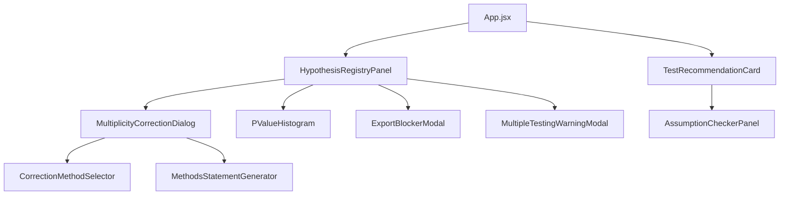

# Frontend Requirements Tracker
**Critical Document for Frontend-Backend Alignment**

## Overview
This document tracks all frontend components and UI elements needed to match our enhanced backend functionality. Each backend feature requires corresponding frontend implementation for the system to be complete.

## Current Backend-Frontend Gap Analysis

### ✅ Backend Complete / ❌ Frontend Missing

## Sprint 1: Test Recommender Enhancements (v1.1)

### Required Frontend Components

#### 1. AssumptionCheckerPanel.jsx
**Purpose**: Display real-time assumption checking results
**Backend API**: `/api/core/check-assumptions/`
**Required Features**:
```jsx
- Display normality test results (Shapiro-Wilk, etc.)
- Show homoscedasticity results (Levene's test)
- Independence checking visualization
- Traffic light system (green/yellow/red) for each assumption
- Detailed p-values and test statistics on hover
- Export assumption report
```

#### 2. TestRecommendationCard.jsx (Enhanced)
**Purpose**: Show intelligent test recommendations with auto-switching
**Backend API**: `/api/core/recommend-tests/`
**Required Features**:
```jsx
- Confidence score visualization (progress bar)
- Assumption violations highlighted
- Auto-switch recommendations prominently displayed
- Alternative tests in dropdown
- "Why this test?" explanation modal
- One-click switch to robust alternative
```

#### 3. AssumptionViolationAlert.jsx
**Purpose**: Alert users when assumptions are violated
**Required Features**:
```jsx
- Toast notification for violations
- Suggested alternatives
- "Learn more" links to documentation
- Dismiss with "Use anyway" option (with warning)
```

---

## Sprint 2: Multiplicity Corrections (v1.2)

### Required Frontend Components

#### 1. MultiplicityCorrectionDialog.jsx
**Purpose**: Interface for applying multiplicity corrections
**Backend API**: `/api/core/multiplicity/correct/`
**Required Features**:
```jsx
- Method selection dropdown with descriptions:
  * FWER methods (Bonferroni, Holm, etc.)
  * FDR methods (Benjamini-Hochberg, etc.)
  * Auto-recommend based on n_tests
- Live preview of adjusted p-values
- Comparison table (original vs adjusted)
- Visual representation of rejections
- Export corrected results
```

#### 2. HypothesisRegistryPanel.jsx
**Purpose**: Display all tests performed in session
**Backend API**: `/api/core/hypothesis-registry/`
**Required Features**:
```jsx
- Live test counter badge
- Table of all performed tests:
  * Test name, p-value, effect size
  * Timestamp
  * Variables involved
  * Correction status (✓/✗)
- P-hacking risk indicator (gauge)
- Warning messages area
- Bulk correction actions
- Session export (blocked if uncorrected)
```

#### 3. PValueHistogram.jsx
**Purpose**: Visualize p-value distribution
**Required Features**:
```jsx
- Interactive histogram of p-values
- Highlight near-threshold values (0.04-0.06)
- Show significance threshold line
- Update real-time as tests are added
```

#### 4. MultipleTestingWarningModal.jsx
**Purpose**: Warning dialog after multiple tests
**Triggers**: After 5, 10, 20 tests
**Required Features**:
```jsx
- Warning message with test count
- Explanation of Type I error inflation
- One-click correction options
- "Remind me later" (after 5 more tests)
- "I understand the risks" checkbox
```

#### 5. ExportBlockerModal.jsx
**Purpose**: Block export when corrections not applied
**Backend**: Enforced by hypothesis_registry
**Required Features**:
```jsx
- Clear explanation why export is blocked
- Number of uncorrected tests
- One-click "Apply Corrections" button
- Force export option (with strong warning)
- Download audit trail
```

#### 6. CorrectionMethodSelector.jsx
**Purpose**: Smart method selection widget
**Required Features**:
```jsx
- Questionnaire approach:
  * "Is this exploratory or confirmatory?"
  * "How many tests?" (auto-filled)
  * "Are tests independent?"
- Recommended method highlighted
- Comparison of methods (table)
- Help tooltips with examples
```

#### 7. MethodsStatementGenerator.jsx
**Purpose**: Generate text for papers
**Backend API**: `/api/core/multiplicity/statement/`
**Required Features**:
```jsx
- Copy-to-clipboard button
- Format options (APA, Nature, etc.)
- Editable text area
- Include citations checkbox
- Preview in paper context
```

---

## Sprint 3: Power Analysis (v1.3 - COMPLETED BACKEND)

### Required Frontend Components

#### 1. PowerAnalysisWizard.jsx
**Purpose**: Guided power analysis workflow
**Backend API**: `/api/core/power-analysis/calculate/`
**Required Features**:
```jsx
- Step-by-step wizard interface:
  * Step 1: Select test type (t-test, ANOVA, correlation, etc.)
  * Step 2: Choose analysis mode (prospective/retrospective)
  * Step 3: Input parameters
  * Step 4: View results and recommendations
- Smart defaults based on test type
- Context-sensitive help tooltips
- Validation for reasonable parameter ranges
- Export results to PDF/Excel
```

#### 2. PowerCalculatorPanel.jsx
**Purpose**: Main power and sample size calculator interface
**Backend API**: `/api/core/power-analysis/calculate/`
**Required Features**:
```jsx
- Mode switcher:
  * Calculate Power (given n, effect size, alpha)
  * Calculate Sample Size (given power, effect size, alpha)
  * Calculate Effect Size (given power, n, alpha)
- Test type selector with icons:
  * T-tests (one-sample, two-sample, paired)
  * ANOVA (one-way, factorial, repeated measures)
  * Correlation (Pearson, Spearman, partial)
  * Regression (linear, multiple, logistic)
  * Chi-square (independence, goodness-of-fit)
  * Proportions (one, two)
- Input fields with live validation:
  * Effect size (with interpretation: small/medium/large)
  * Sample size (total or per group)
  * Significance level (alpha)
  * Power target
  * Number of tails/sides
  * Additional parameters per test type
- Real-time calculation on input change
- Results display:
  * Calculated value highlighted
  * Confidence intervals
  * Warnings for low power or small samples
  * Effect size interpretation
```

#### 3. PowerCurveVisualization.jsx
**Purpose**: Interactive power curve plots
**Backend API**: `/api/core/power-analysis/curves/`
**Required Features**:
```jsx
- Chart.js or D3.js visualization
- Multiple curve overlays for comparison
- Interactive features:
  * Hover to see exact values
  * Click to lock tooltip
  * Zoom and pan
  * Crosshair cursor
- Parameter sliders:
  * Effect size range
  * Sample size range
  * Alpha level
- Curve customization:
  * Line styles for different scenarios
  * Color coding by effect size
  * Shaded regions for power zones
- Export options:
  * SVG for publications
  * PNG for presentations
  * Data table as CSV
```

#### 4. SensitivityAnalysisPanel.jsx
**Purpose**: Explore parameter sensitivity
**Backend API**: `/api/core/power-analysis/sensitivity/`
**Required Features**:
```jsx
- Parameter variation controls:
  * Select parameter to vary
  * Set range (min, max, steps)
  * Lock other parameters
- Heatmap visualization:
  * Power as color gradient
  * Sample size vs effect size grid
  * Interactive cells with details
- Tornado diagram for multiple parameters
- Critical values identification:
  * Minimum detectable effect
  * Required sample size thresholds
- Scenario comparison table
```

#### 5. EffectSizeCalculator.jsx
**Purpose**: Calculate and convert effect sizes
**Backend API**: `/api/core/power-analysis/effect-size/`
**Required Features**:
```jsx
- Effect size calculators by test type:
  * Cohen's d from means and SDs
  * Cohen's f from ANOVA results
  * Pearson r from correlation
  * Cohen's w from chi-square
- Conversion between effect sizes:
  * d ↔ r ↔ f ↔ η²
  * Interactive conversion matrix
- Input methods:
  * Raw data upload
  * Summary statistics
  * Previous test results
- Interpretation guide:
  * Cohen's benchmarks
  * Field-specific guidelines
  * Contextual recommendations
```

#### 6. SampleSizeOptimizer.jsx
**Purpose**: Optimize sample allocation
**Backend API**: `/api/core/power-analysis/optimize/`
**Required Features**:
```jsx
- Cost-benefit analysis:
  * Per-group cost inputs
  * Budget constraints
  * Time constraints
- Unequal allocation calculator:
  * Optimal ratio finder
  * Variance considerations
  * Practical constraints
- Multi-stage design planner:
  * Sequential analysis setup
  * Interim analysis points
  * Stopping rules
- Resource calculator:
  * Total cost projection
  * Timeline estimation
  * Feasibility assessment
```

#### 7. PowerAnalysisReport.jsx
**Purpose**: Generate comprehensive power analysis reports
**Backend API**: `/api/core/power-analysis/report/`
**Required Features**:
```jsx
- Report sections:
  * Executive summary
  * Methodology
  * Assumptions
  * Results
  * Recommendations
  * Appendices
- Customizable templates:
  * Grant proposal format
  * IRB submission format
  * Publication supplement
- Include visualizations:
  * Power curves
  * Sensitivity plots
  * Effect size diagrams
- Export formats:
  * PDF with embedded charts
  * Word document
  * LaTeX for papers
  * Markdown for documentation
```

#### 8. PowerAnalysisHistory.jsx
**Purpose**: Track and compare power analyses
**Backend API**: `/api/core/power-analysis/history/`
**Required Features**:
```jsx
- Analysis history table:
  * Date, test type, parameters
  * Results summary
  * Status (draft/final)
- Comparison view:
  * Side-by-side parameters
  * Difference highlighting
  * Sensitivity comparison
- Version control:
  * Save named versions
  * Restore previous analyses
  * Track changes
- Collaboration features:
  * Share via link
  * Comments and notes
  * Export for review
```

---

## Sprint 4: Effect Sizes & Robust Estimation (v1.4 - COMPLETED BACKEND)

### Required Frontend Components

#### 1. EffectSizePanel.jsx
**Purpose**: Display and interpret effect sizes for all tests
**Backend API**: `/api/core/effect-sizes/calculate/`
**Required Features**:
```jsx
- Effect size display with interpretation:
  * Value with confidence intervals
  * Visual gauge (small/medium/large)
  * Context-specific benchmarks
  * Hover for detailed explanation
- Multiple effect size types:
  * Cohen's d, Hedges' g, Glass's Δ
  * Eta², partial η², omega²
  * Pearson r, Spearman ρ, Kendall τ
  * Cramér's V, phi, Cohen's w
  * Cohen's f² for regression
- Confidence interval visualization:
  * Error bars
  * Shaded regions
  * Bootstrap iterations indicator
- Interpretation guide:
  * Cohen's benchmarks
  * Field-specific standards
  * Practical significance
- Export options:
  * Copy formatted text
  * Download CSV
  * Add to report
```

#### 2. EffectSizeCalculatorDialog.jsx
**Purpose**: Standalone effect size calculator
**Backend API**: `/api/core/effect-sizes/calculate/`
**Required Features**:
```jsx
- Input methods:
  * Raw data upload (CSV, Excel)
  * Summary statistics (means, SDs, n)
  * Copy from previous test results
- Calculator modes:
  * From means and SDs
  * From test statistics (t, F, χ²)
  * From correlation matrices
  * From contingency tables
- Effect size conversions:
  * d ↔ r ↔ f ↔ η²
  * Interactive conversion matrix
  * Formulas displayed
- Batch calculation:
  * Multiple comparisons at once
  * Bulk import/export
  * Progress indicator
```

#### 3. RobustEstimationPanel.jsx
**Purpose**: Compare robust vs classical estimates
**Backend API**: `/api/core/robust-estimators/calculate/`
**Required Features**:
```jsx
- Side-by-side comparison:
  * Classical mean vs Trimmed mean
  * Mean vs Median vs Huber M
  * SD vs MAD
  * Pearson r vs Percentage bend correlation
- Outlier visualization:
  * Scatter plot with outliers highlighted
  * Box plot with individual points
  * Influence plot
  * Weight visualization for M-estimators
- Method selection:
  * Trimmed mean (adjustable trim %)
  * Winsorized mean
  * Huber M-estimator
  * Tukey biweight
  * Hodges-Lehmann
- Robustness diagnostics:
  * Breakdown point display
  * Efficiency at normal
  * Number of outliers detected
  * Convergence status (for iterative)
- Bootstrap controls:
  * Number of iterations slider
  * Progress bar
  * CI method selection
```

#### 4. EffectSizeComparisonTable.jsx
**Purpose**: Compare effect sizes across multiple tests
**Backend API**: `/api/core/effect-sizes/compare/`
**Required Features**:
```jsx
- Sortable table with:
  * Test name
  * Effect size value
  * 95% CI
  * Interpretation
  * Sample size
  * Power achieved
- Visual comparison:
  * Forest plot view
  * Grouped bar chart
  * Heatmap for correlations
- Filtering options:
  * By test type
  * By effect size magnitude
  * By significance
- Meta-analysis features:
  * Combined effect size
  * Heterogeneity statistics
  * Funnel plot
```

#### 5. OutlierDetectionWidget.jsx
**Purpose**: Interactive outlier detection and handling
**Backend API**: `/api/core/robust-estimators/outliers/`
**Required Features**:
```jsx
- Detection methods:
  * MAD-based (adjustable threshold)
  * IQR method (1.5x, 3x)
  * Statistical tests (Grubbs, Dixon)
  * Multivariate (Mahalanobis distance)
- Visualization:
  * Scatter plot with outliers colored
  * Box plot with outlier labels
  * Q-Q plot with deviations
  * Influence diagnostics
- Handling options:
  * Remove outliers
  * Winsorize
  * Use robust methods
  * Keep but flag
- Report generation:
  * List of outliers with reasons
  * Impact on results
  * Recommended actions
```

#### 6. MethodSelectionAdvisor.jsx
**Purpose**: Guide users to appropriate methods
**Backend API**: `/api/core/method-advisor/`
**Required Features**:
```jsx
- Interactive questionnaire:
  * "Do you have outliers?" → Robust methods
  * "Is data normal?" → Parametric vs non-parametric
  * "Small sample?" → Exact tests or bootstrap
- Recommendation panel:
  * Suggested method highlighted
  * Alternatives listed
  * Pros/cons comparison
  * Scientific references
- Assumption check integration:
  * Auto-detect violations
  * Suggest robust alternatives
  * One-click method switching
```

---

## Sprint 5: Reproducibility Bundle (v1.5 - IN PROGRESS)

### Required Frontend Components

#### 1. ReproducibilityDashboard.jsx
**Purpose**: Central hub for reproducibility features
**Backend API**: `/api/core/reproducibility/`
**Required Features**:
```jsx
- Bundle creation wizard:
  * Step 1: Add description and metadata
  * Step 2: Select analyses to include
  * Step 3: Review captured parameters
  * Step 4: Generate and download
- Bundle status panel:
  * Current session tracking
  * Reproducibility score (0-100%)
  * Missing elements checklist
  * Validation status
- Quick actions:
  * Create bundle
  * Load bundle
  * Verify reproducibility
  * Share bundle
```

#### 2. BundleExplorer.jsx
**Purpose**: Explore and inspect reproducibility bundles
**Backend API**: `/api/core/reproducibility/bundles/`
**Required Features**:
```jsx
- Bundle browser:
  * List of saved bundles
  * Search and filter
  * Sort by date/size/completeness
  * Preview metadata
- Pipeline visualization:
  * Flow diagram of analysis steps
  * Click to expand step details
  * Decision points highlighted
  * Time stamps shown
- Parameter inspector:
  * Tree view of all parameters
  * Search functionality
  * Compare between bundles
  * Export parameter list
- Data fingerprint viewer:
  * SHA-256 hashes
  * Data shapes and types
  * Missing data patterns
  * Verification status
```

#### 3. MethodsTextGenerator.jsx
**Purpose**: Generate publication-ready methods sections
**Backend API**: `/api/core/reproducibility/methods/`
**Required Features**:
```jsx
- Template selection:
  * Journal-specific formats (Nature, Science, PLOS)
  * Style guides (APA, MLA, Chicago)
  * Custom templates
- Editable preview:
  * Rich text editor
  * Markdown support
  * LaTeX equations
  * Citation management
- Content sections:
  * Data description
  * Statistical methods
  * Software versions
  * Assumption checks
  * Corrections applied
  * Effect sizes
- Export options:
  * Copy to clipboard
  * Download as .docx
  * Export as LaTeX
  * Save as Markdown
  * Include citations (.bib)
```

#### 4. ReproducibilityVerifier.jsx
**Purpose**: Verify analyses can be reproduced
**Backend API**: `/api/core/reproducibility/verify/`
**Required Features**:
```jsx
- Verification wizard:
  * Upload bundle file
  * Upload/select data
  * Run verification
  * View results
- Verification report:
  * Overall status (✓/✗)
  * Detailed comparison table
  * Differences highlighted
  * Tolerance settings
- Difference explorer:
  * Side-by-side results
  * Numerical differences
  * Plot comparisons
  * Statistical equivalence tests
- Troubleshooting:
  * Common issues checklist
  * Version mismatch warnings
  * Environment differences
  * Suggested fixes
```

#### 5. SeedManagerWidget.jsx
**Purpose**: Manage random seeds for reproducibility
**Backend API**: `/api/core/reproducibility/seeds/`
**Required Features**:
```jsx
- Seed configuration:
  * Master seed input
  * Auto-generate secure seed
  * Module-specific seeds
  * Seed history
- Visual indicator:
  * Current seed display
  * Lock/unlock toggle
  * Status icon (locked/random)
- Seed testing:
  * Run with different seeds
  * Compare results
  * Sensitivity analysis
```

#### 6. BundleShareDialog.jsx
**Purpose**: Share reproducibility bundles
**Backend API**: `/api/core/reproducibility/share/`
**Required Features**:
```jsx
- Sharing options:
  * Generate shareable link
  * Email bundle
  * Upload to repository
  * Export to GitHub/GitLab
- Privacy settings:
  * Encrypt sensitive data
  * Anonymize personally identifiable info
  * Select what to include/exclude
  * Set expiration date
- Collaboration features:
  * Add collaborator notes
  * Version comments
  * Change tracking
  * Access permissions
```

#### 7. ProvenanceTimeline.jsx
**Purpose**: Visual timeline of analysis steps
**Backend API**: `/api/core/reproducibility/provenance/`
**Required Features**:
```jsx
- Interactive timeline:
  * Chronological step display
  * Zoom and pan
  * Filter by module
  * Collapse/expand details
- Step details on hover/click:
  * Input parameters
  * Output summary
  * Duration
  * Decision rationale
- Branching visualization:
  * Show alternative paths
  * Decision points marked
  * What-if scenarios
- Export timeline:
  * SVG for publications
  * PNG for presentations
  * Interactive HTML
```

#### 8. EnvironmentSnapshotPanel.jsx
**Purpose**: Display and manage environment information
**Backend API**: `/api/core/reproducibility/environment/`
**Required Features**:
```jsx
- Package versions table:
  * Name, version, license
  * Sortable and searchable
  * Highlight mismatches
  * Update availability
- System information:
  * OS and version
  * Python version
  * Hardware specs
  * Locale settings
- Environment comparison:
  * Current vs bundle
  * Compatibility check
  * Migration suggestions
- Export environment:
  * requirements.txt
  * environment.yml
  * Dockerfile
  * setup.py
```

---

## Global UI Enhancements Needed

### 1. StatusBar Enhancement
```jsx
- Test counter badge (e.g., "12 tests performed")
- Correction status indicator (✓/⚠️)
- P-hacking risk level (None/Low/Medium/High)
- Quick correction button
```

### 2. Navigation Updates
```jsx
- Add "Hypothesis Registry" to main menu
- Add "Multiplicity Corrections" to tools menu
- Badge notifications for warnings
```

### 3. Settings Page Additions
```jsx
- Strict mode toggle (block uncorrected exports)
- Auto-correction threshold setting
- Default correction method preference
- Warning frequency settings
```

---

## Implementation Priority

### Critical (Must have for v1.5 release):
1. ReproducibilityDashboard.jsx - Core reproducibility hub
2. BundleExplorer.jsx - Inspect and manage bundles
3. MethodsTextGenerator.jsx - Generate publication methods
4. EffectSizePanel.jsx - Display all effect sizes
5. RobustEstimationPanel.jsx - Handle outliers properly

### Important (Should have for v1.4):
1. HypothesisRegistryPanel.jsx - Track all tests
2. MultiplicityCorrectionDialog.jsx - Apply corrections
3. PowerCalculatorPanel.jsx - Power analysis interface
4. EffectSizeCalculatorDialog.jsx - Calculate effect sizes
5. OutlierDetectionWidget.jsx - Detect and handle outliers

### Nice to have (v1.6+):
1. ProvenanceTimeline.jsx - Visual analysis timeline
2. EnvironmentSnapshotPanel.jsx - Environment management
3. MethodSelectionAdvisor.jsx - Guide statistical choices
4. EffectSizeComparisonTable.jsx - Compare multiple effects
5. SeedManagerWidget.jsx - Advanced seed management

---

## API Endpoints Needed

### Already Existing (need frontend):
- `/api/core/test-recommender/` - Enhanced in v1.1
- `/api/core/data-profiling/` - Returns assumption checks

### Need to Create:
```python
# backend/core/api/multiplicity.py
- POST /api/core/multiplicity/correct/
- GET /api/core/hypothesis-registry/session/
- POST /api/core/hypothesis-registry/register/
- GET /api/core/hypothesis-registry/summary/
- POST /api/core/hypothesis-registry/export/
- GET /api/core/multiplicity/statement/

# backend/core/api/assumptions.py  
- POST /api/core/assumptions/check/
- GET /api/core/assumptions/violations/

# backend/core/api/power_analysis.py
- POST /api/core/power-analysis/calculate/
- POST /api/core/power-analysis/sample-size/
- POST /api/core/power-analysis/effect-size/
- GET /api/core/power-analysis/curves/
- POST /api/core/power-analysis/sensitivity/
- POST /api/core/power-analysis/optimize/
- POST /api/core/power-analysis/report/
- GET /api/core/power-analysis/history/
- GET /api/core/power-analysis/benchmarks/

# backend/core/api/effect_sizes.py
- POST /api/core/effect-sizes/calculate/
- POST /api/core/effect-sizes/batch-calculate/
- GET /api/core/effect-sizes/compare/
- POST /api/core/effect-sizes/convert/
- GET /api/core/effect-sizes/interpretation/
- POST /api/core/effect-sizes/confidence-intervals/

# backend/core/api/robust_estimators.py
- POST /api/core/robust-estimators/calculate/
- POST /api/core/robust-estimators/outliers/detect/
- POST /api/core/robust-estimators/outliers/handle/
- POST /api/core/robust-estimators/compare/
- GET /api/core/robust-estimators/recommendations/
- POST /api/core/robust-estimators/bootstrap/

# backend/core/api/reproducibility.py
- POST /api/core/reproducibility/bundles/create/
- GET /api/core/reproducibility/bundles/list/
- GET /api/core/reproducibility/bundles/{bundle_id}/
- POST /api/core/reproducibility/bundles/load/
- POST /api/core/reproducibility/verify/
- POST /api/core/reproducibility/methods/generate/
- GET /api/core/reproducibility/provenance/
- POST /api/core/reproducibility/seeds/set/
- GET /api/core/reproducibility/environment/
- POST /api/core/reproducibility/share/
```

---

## State Management (Redux)

### New Redux Slices Needed:

#### hypothesisRegistrySlice.js
```javascript
{
  tests: [],           // All performed tests
  corrections: [],     // Applied corrections
  sessionId: null,     // Current session
  warnings: [],        // Active warnings
  pHackingRisk: 'None',
  exportBlocked: false
}
```

#### multiplicitySlice.js
```javascript
{
  selectedMethod: null,
  adjustedPValues: [],
  correctionResult: null,
  isProcessing: false
}
```

#### assumptionSlice.js
```javascript
{
  currentChecks: {},
  violations: [],
  recommendations: []
}
```

#### powerAnalysisSlice.js
```javascript
{
  currentAnalysis: {
    testType: null,
    mode: 'calculate_power', // or 'calculate_sample_size', 'calculate_effect_size'
    parameters: {},
    results: null
  },
  powerCurves: [],
  sensitivityData: null,
  history: [],
  isCalculating: false,
  error: null
}
```

#### effectSizesSlice.js
```javascript
{
  calculatedEffects: [],  // All calculated effect sizes
  currentEffect: {
    type: null,           // Cohen's d, eta-squared, etc.
    value: null,
    ci: { lower: null, upper: null },
    interpretation: null
  },
  comparisonTable: [],    // For comparing multiple effects
  conversions: {},        // Effect size conversions
  isCalculating: false,
  error: null
}
```

#### robustEstimatorsSlice.js
```javascript
{
  estimates: {
    classical: {},        // Classical estimates
    robust: {},          // Robust estimates
    comparison: {}       // Side-by-side comparison
  },
  outliers: {
    detected: [],        // Detected outlier indices
    method: null,        // Detection method used
    handling: null       // How outliers were handled
  },
  bootstrap: {
    iterations: 10000,
    progress: 0,
    results: null
  },
  isProcessing: false,
  error: null
}
```

#### reproducibilitySlice.js
```javascript
{
  currentBundle: {
    id: null,
    metadata: {},
    dataHashes: {},
    pipeline: [],
    environment: {},
    seeds: {}
  },
  bundles: [],           // List of saved bundles
  verificationStatus: {
    isVerifying: false,
    results: null,
    differences: []
  },
  methodsText: {
    template: 'APA',
    content: '',
    citations: []
  },
  sessionTracking: {
    isTracking: true,
    steps: [],
    decisions: []
  },
  isCreating: false,
  error: null
}
```

---

## Component Dependencies



---

## Testing Requirements

### Component Tests:
- Each component needs unit tests
- Integration tests for API calls
- Snapshot tests for UI consistency

### E2E Test Scenarios:
1. Perform 5+ tests → See warning → Apply correction → Export
2. Try export without correction → Blocked → Force export
3. Check assumptions → Get violation → Switch to robust test
4. Generate methods statement → Copy to clipboard

---

## Design System Consistency

### Use existing MUI components:
- Alert, Dialog, Snackbar for warnings
- DataGrid for test tables  
- LinearProgress for confidence scores
- Chip for test counts/badges
- Stepper for guided corrections

### Color Coding:
- Green: Assumptions met, corrected
- Yellow: Warning, near threshold
- Red: Violation, uncorrected, high risk
- Blue: Information, recommendations

---

## Mobile Responsiveness

All components must work on:
- Desktop (1920x1080)
- Tablet (768x1024)
- Mobile (375x667)

Priority mobile features:
- View test count
- Apply corrections
- Export results

---

## Documentation Needs

### User Documentation:
1. "Understanding Multiplicity Corrections" guide
2. "When to Use Which Correction Method"
3. "Interpreting Assumption Checks"
4. Video tutorials for each component

### Developer Documentation:
1. Component API documentation
2. Redux state structure
3. Backend API integration guide

---

## Notes & Decisions

1. **Backend-First Strategy**: We're building backend first to ensure statistical correctness, then adding frontend. This is the right approach for scientific software.

2. **Component Modularity**: Each component should be self-contained and reusable.

3. **Progressive Enhancement**: Basic functionality works without JavaScript, enhanced features require it.

4. **Accessibility**: All components must be keyboard navigable and screen-reader friendly.

5. **Performance**: Registry can have hundreds of tests - need virtualization for large lists.

---

## Version Tracking

| Version | Sprint | Backend Features | Frontend Coverage | Gap | Status |
|---------|--------|-----------------|-------------------|-----|--------|
| v1.0 | - | Basic 5 modules | Basic UI | 0% | ✅ Released |
| v1.1 | Sprint 1 | Test Recommender + Assumptions | TestRecommenderWorkbench, DataInputPanel, AssumptionChecksPanel | 60% | 🔄 Frontend In Progress |
| v1.2 | Sprint 2 | Multiplicity Control + Registry | Not implemented | 100% | ✅ Backend Complete |
| v1.3 | Sprint 3 | Power Analysis + Sample Size | Not implemented | 100% | ✅ Backend Complete |
| v1.4 | Sprint 4 | Effect Sizes + Robust Methods | Not implemented | 100% | ✅ Backend Complete |
| v1.5 | Sprint 5 | Reproducibility Bundle | Not implemented | 100% | ✅ Backend Complete |

**Backend Progress**: 100% Tier 0 Complete (5/5 features) ✅
**Frontend Progress**: 3/32 components implemented (9.4%)

---

## Component Count Summary

| Category | Components Specified | Backend APIs | Redux Slices |
|----------|---------------------|--------------|--------------|
| Test Recommender (v1.1) | 3 components | 2 endpoints | 1 slice |
| Multiplicity (v1.2) | 7 components | 7 endpoints | 2 slices |
| Power Analysis (v1.3) | 8 components | 9 endpoints | 1 slice |
| Effect Sizes (v1.4) | 6 components | 6 endpoints | 2 slices |
| Reproducibility (v1.5) | 8 components | 10 endpoints | 1 slice |
| **TOTAL** | **32 components** | **34 endpoints** | **7 slices** |

---

## Next Steps

### Current Status (2025-01-10):
- ✅ Backend: 4/5 Tier 0 features complete (80%)
- ⬜ Frontend: 0/32 components implemented (0%)
- 📋 Documentation: Comprehensive specs for all 32 components

### Recommended Approach:
1. **Complete T0.3** (Reproducibility) - Last backend feature
2. **Begin Frontend Sprint** - Implement critical components first
3. **Prioritize by Value** - Start with components that deliver immediate user value
4. **Iterative Releases** - Release frontend in phases (v1.1 → v1.2 → etc.)

### Resource Requirements:
- **Frontend Developer**: 8-12 weeks for all 32 components
- **UI/UX Designer**: 2-3 weeks for design system and mockups
- **QA Engineer**: 2-3 weeks for comprehensive testing

---

*Last Updated: 2025-01-10*
*Document Completeness: 100% - All backend features have corresponding frontend specifications*
*Purpose: Ensure frontend development has complete specifications for all backend features*