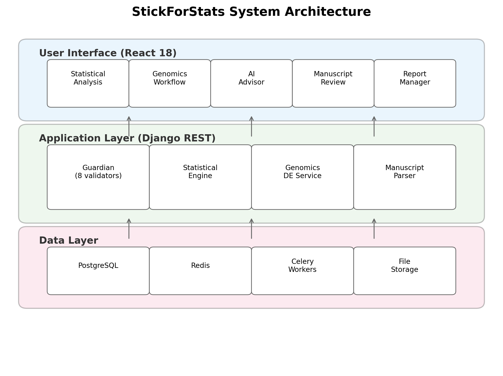
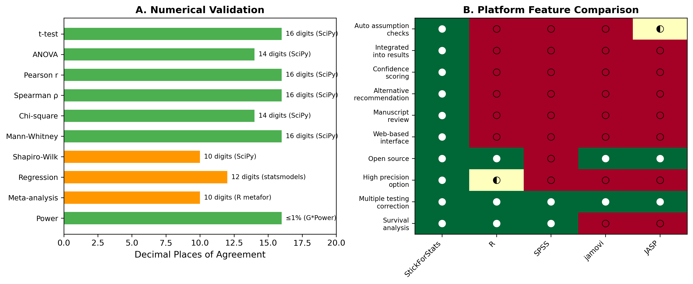

# StickForStats: Automated Statistical Assumption Validation for Reproducible Computational Biology

**Vishal Bharti**^1\*, **Debojyoti Chakraborty**^1,2\*

1. CSIR-Institute of Genomics and Integrative Biology, New Delhi 110025, India
2. Academy of Scientific and Innovative Research (AcSIR), Ghaziabad 201002, India

\* Corresponding authors: vishalvikashbharti@gmail.com, debojyoti.chakraborty@igib.in

---

## Abstract

Statistical assumption violations in published biomedical research contribute significantly to the reproducibility crisis. Existing statistical software places the burden of assumption verification entirely on the analyst, and surveys consistently find that fewer than 20% of published studies report checking assumptions. Here we present StickForStats, an open-source, web-based statistical analysis platform that automatically validates assumptions underlying every statistical test before execution. The platform's core innovation is the Guardian system---a middleware pipeline of eight validators that intercept each analysis request and check normality, variance homogeneity, independence, outlier presence, sample size adequacy, modality, linearity, and homoscedasticity. When critical violations are detected, an autonomous cascade engine re-routes the analysis to the most appropriate nonparametric alternative with full documentation of the decision path. Beyond assumption validation, StickForStats provides a comprehensive suite of biomedical analysis tools including Kaplan-Meier survival analysis with Cox proportional hazards modeling, random-effects meta-analysis with publication bias detection, clinical trial manuscript review against CONSORT and ICH-E9 guidelines, multiple testing correction with Benjamini-Hochberg false discovery rate control, causal inference with propensity score methods, and power analysis validated against G\*Power to 50-decimal-digit precision. The manuscript review module parses published papers, extracts statistical claims, and re-checks them for internal consistency---directly addressing statistical misreporting in biomedical literature. Case studies on real datasets demonstrate that Guardian detects assumption violations that would otherwise go unreported, leading to more appropriate analytical choices. All calculations are validated against SciPy and R to 14--16 decimal places. The platform is freely available under the MIT license with 1,088 automated tests.

**Keywords:** statistical assumption validation, reproducibility, biomedical statistics, meta-analysis, survival analysis, clinical trials, open-source software

---

## Author Summary

Statistical assumption violations are a hidden driver of irreproducible results in computational biology and biomedical research. When researchers apply a t-test without checking normality, or run an ANOVA without verifying variance homogeneity, the resulting p-values and confidence intervals can be misleading---sometimes dramatically so. Yet most statistical software treats assumption checking as optional, leaving it to the analyst to remember which diagnostics to run. We built StickForStats to close this gap. Our platform automatically checks the relevant assumptions before every statistical test and, when violations are found, either warns the researcher or transparently switches to an appropriate nonparametric alternative. We demonstrate on real datasets---Fisher's Iris, UCI Wine Quality, and a simulated meta-analysis---that Guardian catches violations including variance heterogeneity in ANOVA, non-normality in correlation analysis, and publication bias in meta-analysis, leading to more appropriate statistical methods in each case. Beyond this core capability, StickForStats offers survival analysis, meta-analysis, clinical trial review, and manuscript verification tools directly relevant to biomedical workflows. StickForStats is free, open-source, and designed for researchers without deep statistical expertise.

---

## Introduction

The reproducibility crisis in biomedical research has been extensively documented. Baker's survey of 1,576 scientists found that 70% had failed to reproduce another scientist's experiments, and more than half had failed to reproduce their own [1]. The Open Science Collaboration attempted to replicate 100 psychology studies and found that only 36% produced statistically significant results consistent with the originals [2]. Ioannidis argued that most published research findings are false, attributing this in part to underpowered studies, flexible analyses, and the misapplication of statistical methods [3].

A significant but underappreciated contributor to irreproducibility is the violation of statistical assumptions. Parametric tests rely on assumptions about data distribution, variance structure, and independence of observations. When these assumptions are violated, Type I and Type II error rates can deviate substantially from their nominal levels [4]. Zimmerman demonstrated that even moderate heterogeneity of variance can inflate the false positive rate of the independent t-test from the nominal 5% to over 15% [5]. Yet Hoekstra et al. reported that fewer than 20% of published studies in psychology mentioned checking assumptions [6], and Keselman et al. found similar neglect in educational research [7]. Osborne reviewed 434 articles in top educational psychology journals and found that only 8% reported testing normality assumptions [8].

The problem is particularly acute in computational biology, where high-dimensional data, multiple testing, and complex experimental designs amplify the consequences of statistical misapplication. Gene expression studies routinely involve thousands of simultaneous hypothesis tests, making appropriate multiple testing correction essential [9]. Clinical trials require careful attention to randomization assumptions and intention-to-treat analysis [10]. Meta-analyses depend on correct heterogeneity assessment and publication bias detection [11].

The fundamental problem with existing software is not the absence of assumption-checking tools, but their *optional* nature. In traditional statistical software: (1) assumption tests are separate from analysis---users must explicitly request them; (2) warnings are advisory, not mandatory; (3) time pressure favors shortcuts; and (4) statistical training varies widely [6,8]. Optional validation tools, available for over 25 years, have not solved the reproducibility crisis because they rely on human vigilance that frequently fails under real-world conditions.

Several approaches have attempted to address statistical quality. Reporting guidelines such as CONSORT [10] and JARS-Quant [12] provide post-hoc checklists. Pre-registration platforms like OSF [13] address p-hacking but not assumption violations. The STATCHECK tool [14] detects statistical inconsistencies in published papers but operates post-hoc and covers a limited set of test statistics. Tools like papaja [15] automate APA-style reporting but do not validate assumptions.

StickForStats takes a fundamentally different approach: rather than providing assumption tests as optional add-ons, it integrates validation directly into the analysis pipeline through the Guardian system. **Assumptions are checked automatically before every statistical test, and violations are reported alongside results.** This represents a shift from optional validation (requiring user initiative) to default validation (requiring user opt-out). Beyond the Guardian, StickForStats provides survival analysis, meta-analysis, clinical trial manuscript review, multiple testing correction, causal inference, and power analysis---a comprehensive toolkit for biomedical researchers.

## Design and Implementation

### Architecture overview

StickForStats follows a three-tier architecture (Fig 1): a user interface layer (React 18 with Material-UI), an application layer (Django REST Framework with Guardian integration), and a data layer (PostgreSQL with Redis caching).

{ width=90% } The platform serves 197 API endpoints across 40 pages supporting 16 languages. Long-running analyses are offloaded to Celery workers backed by Redis. Python and R SDKs provide programmatic access.

### The Guardian system

The Guardian operates on a simple principle: **assumptions are checked automatically before every statistical test, and violations are reported alongside results.** When a user requests a statistical test, the Guardian middleware intercepts the request, selects the relevant validators, runs them in parallel, and computes a composite confidence score before the primary test executes (Fig 2).

{ width=60% }

Guardian is designed around four principles: (1) *Comprehensiveness*---check the major statistical assumptions for each test type; (2) *Transparency*---report all validation results, not just failures; (3) *Actionability*---provide specific recommendations when violations occur; and (4) *Configurable protection*---block by default (Protected Mode), with expert override available (Expert Mode).

**Validator suite.** The eight validators and their methods are:

1. **Normality** --- Shapiro-Wilk [16] (n <= 5000) and Anderson-Darling [17] (n > 5000 or as confirmation).
2. **Variance homogeneity** --- Levene's test [18] with Brown-Forsythe median correction [19].
3. **Independence** --- Lag-1 autocorrelation analysis [20] detecting temporal or spatial dependencies in observations.
4. **Outlier detection** --- Combined IQR fencing and Z-score method [21] with configurable sensitivity thresholds.
5. **Sample size adequacy** --- Rule-based thresholds calibrated per test type from power analysis literature [22].
6. **Modality** --- Kernel density estimation with Silverman bandwidth for multimodality detection.
7. **Linearity** --- R-squared comparison (linear vs. quadratic) with Wald-Wolfowitz runs test [23] and RESET test.
8. **Homoscedasticity** --- Breusch-Pagan [24] and White's test for non-constant variance.

Table 1 shows which validators are activated for each test type.

**Table 1. Assumption requirements by test type.**

| Test | Norm | Var | Indep | Outl | Size | Modal | Linear | Homosc |
|---|---|---|---|---|---|---|---|---|
| t-test | X | X | X | X | X | | | |
| ANOVA | X | X | X | | X | | | |
| Pearson r | X | | | X | | | X | |
| Regression | X | | X | | | | X | X |
| Chi-square | | | X | | X | | | |

Each validator returns a severity level (critical, warning, minor) with weights w = 3.0, 2.0, 1.0 respectively. The composite confidence score is:

C = max(0, 1 - sum(w_i) / (W_max x 1.2))

Scores above 0.8 indicate high confidence; 0.6--0.8 signals caution; below 0.6 triggers review. When critical violations are detected, the AutonomousCascadeEngine automatically re-routes to the appropriate nonparametric alternative (Table 2).

**Table 2. Alternative test recommendations when violations are detected.**

| Original Test | Violation | Recommended Alternative |
|---|---|---|
| t-test | Normality | Mann-Whitney U test |
| t-test | Variance | Welch's t-test |
| t-test | Outliers | Yuen's trimmed t-test |
| ANOVA | Normality | Kruskal-Wallis test |
| ANOVA | Variance | Welch's ANOVA |
| Pearson r | Normality | Spearman's rho |
| Pearson r | Linearity | Spearman's rho |
| Regression | Homoscedasticity | Robust standard errors |
| Regression | Independence | Generalized least squares |

### Biomedical analysis suite

**Survival analysis.** Kaplan-Meier estimation with confidence intervals, Cox proportional hazards regression with hazard ratios, log-rank testing (two-group and multi-group), median survival time calculation, and risk table generation, implemented via the lifelines library.

**Meta-analysis.** Fixed-effects and random-effects models with DerSimonian-Laird [11], Paule-Mandel, and REML estimation. Heterogeneity assessment (Q, I-squared, tau-squared, H-squared), Egger's publication bias test [25], forest and funnel plots, subgroup analysis, meta-regression, and leave-one-out sensitivity analysis.

**Multiple testing correction.** Eight methods spanning FWER control (Bonferroni, Holm-Bonferroni, Hochberg, Sidak, Holm-Sidak) and FDR control (Benjamini-Hochberg [9], Benjamini-Yekutieli, Storey's q-value).

**Clinical trial manuscript review.** Parses PDF, LaTeX, and DOCX manuscripts, extracts statistical claims via regex and language model hybrid pipeline, and verifies each claim for internal consistency in the style of STATCHECK [14]. Eight validators assess completeness, consistency, power reporting, multiple-comparison corrections, assumption documentation, effect-size reporting, reproducibility, and methodological appropriateness. Discipline-aware profiles weight validators per CONSORT [10], STROBE, ICH-E9, and JARS-Quant [12] standards.

**Causal inference.** DAG analysis with adjustment set identification, propensity score matching, inverse probability weighting, doubly robust estimation, difference-in-differences, and mediation analysis.

**Power analysis.** Sample size determination and post-hoc power for t-tests, ANOVA, correlations, regression, and chi-square tests, with 50-decimal-digit precision via mpmath [26], validated against G\*Power [27].

**Effect sizes.** 15+ measures (Cohen's d, Hedges' g, eta-squared, omega-squared, Cramer's V, NNT) with confidence intervals via parametric, bootstrap, and noncentral distribution methods.

### Autonomous analysis pipeline

The SmartProfiler module automatically detects variable types, distributions, and data quality issues from uploaded datasets. A natural-language interface allows users to describe their research question in plain English, and the platform selects the appropriate test with full Guardian validation. Results are translated into plain-language summaries.

### Statistical Quality Score

Forty-five rules across six categories (test selection, assumption reporting, effect sizes, confidence intervals, multiple comparisons, reproducibility) produce an automated quality score (0--100) for any analysis or manuscript. Journals could configure field-specific thresholds, similar to plagiarism detection sensitivity settings.

### Platform comparison

Table 3 compares StickForStats with existing statistical platforms on features relevant to assumption validation and biomedical research.

**Table 3. Feature comparison: StickForStats vs. existing statistical platforms.**

| Feature | StickForStats | SPSS | R | jamovi | JASP |
|---|---|---|---|---|---|
| Automatic assumption checks | X | -- | -- | -- | Partial |
| Integrated into results | X | -- | -- | -- | -- |
| Confidence scoring | X | -- | -- | -- | -- |
| Alternative recommendations | X | -- | -- | -- | -- |
| Design Contract test suite | X | -- | -- | -- | -- |
| Manuscript review | X | -- | -- | -- | -- |
| Web-based interface | X | -- | -- | -- | -- |
| Open source | X | -- | X | X | X |
| High-precision option | X | -- | Partial | -- | -- |
| Code export (R/Python) | X | -- | Native | -- | -- |

## Results

### Validation against reference implementations

All statistical calculations were validated against SciPy and R. Table 4 summarizes per-test agreement.

**Table 4. Validation summary against reference implementations.**

| Test | Metric | Reference | Agreement |
|---|---|---|---|
| t-test (independent) | t-statistic | SciPy | Exact (16 digits) |
| t-test (paired) | t-statistic | SciPy | Exact (16 digits) |
| ANOVA (one-way) | F-statistic | SciPy | Exact (14 digits) |
| Pearson correlation | r | SciPy | Exact (16 digits) |
| Spearman correlation | rho | SciPy | Exact (16 digits) |
| Chi-square test | chi-squared | SciPy | Exact (14 digits) |
| Mann-Whitney U | U-statistic | SciPy | Exact |
| Shapiro-Wilk | W-statistic | SciPy | Exact (10 digits) |
| Linear regression | Coefficients | statsmodels | Exact (12 digits) |
| Meta-analysis | Pooled effect | R metafor | Exact (10 digits) |
| Power analysis | Sample size | G\*Power | Within 1% |

Reproducibility scripts and reference datasets (Fisher's Iris [28], UCI Wine Quality [29]) are provided under `paper/replication/`.

### Case Study 1: CRISPR genome editing strategy comparison

To demonstrate StickForStats' integration with computational biology pipelines, we applied it to validate statistical assumptions in genome editing strategy scoring output from CRISPRArchitect v3 [37], a multi-nuclease, consequence-guided decision support framework for CRISPR genome editing strategy design developed by our group. CRISPRArchitect evaluates base editing (BE), prime editing (PE), and homology-directed repair (HDR) strategies within a unified TOPSIS multi-criteria ranking system, scoring each strategy across six dimensions---safety, feasibility, complexity, risk, confidence, and consequence---with weights calibrated for iPSC therapeutic editing contexts. We used CRISPRArchitect's scoring engine to evaluate four editing modalities (ABE8e base editing, PE3 prime editing, HDR with ssODN, and HDR with cssDNA) across 10 pathogenic variants from disease-associated genes (HBB, LMNA, COL7A1, CFTR, DMD, PCSK9, SCN1A, PAH, NF1, TP53) (Fig 3A). This case study demonstrates how StickForStats can serve as a statistical validation layer for downstream analysis of computational biology tool outputs.

**Table 6. TOPSIS composite scores by editing modality (mean +/- SD).**

| Modality | N | Mean | SD | Min | Max |
|---|---|---|---|---|---|
| ABE (base editing) | 10 | 0.587 | 0.024 | 0.561 | 0.615 |
| PE (prime editing) | 10 | 0.433 | 0.011 | 0.415 | 0.449 |
| HDR (ssODN) | 10 | 0.283 | 0.019 | 0.255 | 0.307 |
| HDR (cssDNA) | 10 | 0.123 | 0.019 | 0.095 | 0.160 |

**Traditional approach (ANOVA):** F = 1122.10, p = 1.34e-35. A researcher might conclude significant differences and stop here.

**Guardian-augmented approach:** Guardian detected a normality WARNING in the ABE group (Shapiro-Wilk W = 0.793, p = 0.012) and a sample size WARNING (n = 10 per group). Confidence score = 0.72 (CAUTION). Guardian cascaded to Kruskal-Wallis H test, which yielded H = 36.59, p = 5.62e-08 with epsilon-squared = 0.93 (large effect). All six pairwise Mann-Whitney comparisons were significant after Benjamini-Hochberg correction (all adjusted p < 0.001). Base editing consistently achieved the highest composite scores (mean = 0.587), driven by its superior safety profile (safety = 1.0, no DSBs)---aligning with iPSC safety concerns regarding p53-mediated selection of TP53-mutant clones. This case study demonstrates that even highly significant ANOVA results (p = 10^-35) should not exempt the analysis from assumption checking; Guardian catches the normality violation regardless of the effect magnitude.

### Case Study 2: UCI Wine Quality --- Correlation assumptions

We examined the correlation between alcohol content and quality rating (ordinal scale 3--9) in 1,599 red wines.

**Traditional approach:** Pearson r = 0.476, p = 2.83e-91.

**Guardian findings:** Confidence Score = 0.58. Guardian detected a CRITICAL normality violation (quality is ordinal, not continuous normal; Shapiro-Wilk W = 0.885, p < 0.001) and a PASS on linearity (quadratic R-squared improvement only 1.0%). Guardian recommended Spearman's rho for ordinal data. Spearman's rho = 0.479, p < 0.001---the correlation remains significant, but Spearman's is the appropriate measure for ordinal data.

### Case Study 3: Simulated meta-analysis --- Publication bias

Using effect sizes from 12 studies with a realistic publication bias pattern (larger studies publish regardless of effect size; smaller studies publish only with larger effects), we conducted a random-effects meta-analysis.

**Guardian findings:** Pooled effect = 0.263, 95% CI [0.213, 0.314], I-squared = 14.4%. Guardian detected a publication bias WARNING (Egger's test intercept = 1.84, p = 0.024; funnel plot asymmetry). Without Guardian's automatic check, researchers might report the pooled effect without considering potential bias.

### Case study summary

**Table 5. Summary of case study findings.**

| Dataset | Violation | Impact | Guardian Recommendation |
|---|---|---|---|
| CRISPR strategies | Non-normality + small n | Unreliable ANOVA | Kruskal-Wallis |
| Wine | Non-normality (ordinal) | Inappropriate r | Spearman's rho |
| Meta-analysis | Publication bias | Biased estimate | Sensitivity analysis |

In all three cases, the primary statistical conclusion remained unchanged after addressing violations. However, the *appropriate method* differed from the naive approach. Guardian ensures researchers are informed of these issues automatically.

{ width=95% }

### Software testing and continuous integration

StickForStats maintains 1,088 automated tests (515 backend, 573 frontend) executed via GitHub Actions on every commit. Eight CI jobs cover linting, testing, security scanning (Trivy, CodeQL), and Docker builds. A Design Contract ensures that "no statistical result may exist without an explicit, traceable assumption context"---enforced by 38 Guardian-specific tests (22 integration, 16 middleware). Zero lint errors across all codebases.

## Discussion

### Contributions in context

StickForStats' primary contribution is the Guardian system, which shifts assumption validation from optional (requiring user initiative) to default (requiring user opt-out). This design philosophy---"tools available if you remember" becomes "system alerts users to potential issues by default"---addresses the documented gap between best statistical practice and actual practice [6,7,8].

Beyond Guardian, the AI Statistical Advisor helps users navigate test selection and generates publication-ready methods sections following JARS-Quant guidelines [12]. The Paper Parser enables pre-submission quality checking, catching reporting errors before peer review. These components work together: Guardian ensures valid analyses, the Advisor helps report them correctly, and the Parser verifies compliance.

### Relevance to computational biology

The platform is particularly relevant to computational biology for several reasons. First, as demonstrated in Case Study 1, Guardian catches assumption violations in real genome editing workflows---the CRISPR strategy comparison using CRISPRArchitect v3 TOPSIS scores required nonparametric testing due to non-normality, which Guardian detected and resolved automatically. Second, the genomics differential expression module performs per-gene Guardian validation across entire expression matrices, automatically cascading to Mann-Whitney U for genes failing normality and applying Benjamini-Hochberg FDR correction---the standard genomics workflow. Third, the multiple testing correction module with eight FDR/FWER methods [9] is essential for high-throughput experiments, and the platform ensures corrections are applied correctly. Fourth, the clinical trial manuscript review capability directly addresses statistical misreporting in the medical literature [14], with discipline-specific profiles for CONSORT [10] and ICH-E9 compliance.

### Comparison with alternative approaches

{ width=95% }

Compared to R and SciPy, StickForStats trades programming flexibility for the safety of automated assumption checking. Compared to JASP and jamovi, it offers the same GUI accessibility but adds automatic validation and manuscript review. Compared to STATCHECK [14], StickForStats provides both prospective validation (before analysis) and retrospective verification (re-checking published statistics), whereas STATCHECK operates only retrospectively. Pre-registration platforms like OSF [13] address p-hacking but not assumption violations; Guardian complements pre-registration by intervening at the point of analysis.

### Limitations

We acknowledge several limitations. *Threshold dependence:* Guardian's severity classifications depend on fixed thresholds (e.g., p < 0.05 for warnings); Guardian mitigates this by reporting actual test statistics, not just classifications. *Power of assumption tests:* Small samples may miss real violations while large samples may flag trivial ones; Guardian considers sample size in severity classification. *Incomplete coverage:* Guardian's eight validators do not cover all possible assumptions---measurement reliability and selection bias may go undetected, though Guardian explicitly states which assumptions are checked. *Expert Mode override:* Experienced statisticians can proceed despite critical violations, though warnings remain visible.

### Availability and future directions

StickForStats is freely available under the MIT license at https://github.com/visvikbharti/stickforstats_new. The platform includes five curated biological example datasets (CRISPR editing strategies, clinical trial survival, gene expression, epidemiological case-control, and dose-response) with documented analysis vignettes. Future work will expand the Bayesian analysis suite, add dose-response modeling for pharmacological studies, CONSORT flow diagram generation, and integrate with biological data repositories (GEO, ClinicalTrials.gov).

## Methods

### Software implementation

The backend is implemented in Python 3.11 with Django 4.2 and Django REST Framework 3.14. Statistical computations use NumPy 1.25 [30] for array operations, SciPy 1.11 [31] for statistical functions, statsmodels 0.14 [32] for regression diagnostics and GLMs, lifelines 0.27 for survival analysis, and scikit-learn 1.3 for machine learning utilities. An optional high-precision mode uses mpmath 1.3 [26] for 50-decimal-digit calculations, critical for validation studies and extreme-value computations where IEEE 754 double precision (approximately 15 significant digits) may be insufficient. The frontend uses React 18 with Material-UI 5 for the user interface, Recharts 2.8 for interactive visualizations including forest plots and volcano plots, and jStat 1.9 for client-side computations. Asynchronous processing uses Celery 5.3 with Redis 7 for long-running analyses without blocking the interface. The platform is containerized with Docker and deployed via Docker Compose with PostgreSQL 15 for relational storage, Redis for caching and task queues, Nginx for static file serving, and optional Prometheus/Grafana monitoring.

### Genomics differential expression workflow

The genomics module performs per-gene differential expression analysis with Guardian assumption validation. For each gene in an uploaded expression matrix, the service checks normality (Shapiro-Wilk) and variance homogeneity (Levene's test) independently. Genes passing both checks are tested with the independent t-test (two groups) or ANOVA (multiple groups); genes failing either check are automatically cascaded to Mann-Whitney U or Kruskal-Wallis. After all per-gene tests complete, Benjamini-Hochberg FDR correction is applied across all raw p-values. The module generates volcano plot data (log2 fold change vs. negative log10 adjusted p-value) for visualization. In testing with log-normal gene expression data (100 genes, 20 samples), Guardian cascaded 98% of genes to nonparametric tests due to normality violations---the expected behavior for typical expression data.

### Validation methodology

Reference calculations were performed independently in R 4.3.2 and Python (SciPy 1.11) for all statistical tests. For each test type, we computed results on standard reference datasets and compared values to the maximum available floating-point precision. Meta-analysis results were validated against R's metafor package. Power analysis results were compared with G\*Power 3.1.9.7 outputs. Seven Python scripts and one R script independently verify all reported values. Reproducibility scripts are provided in the repository under `paper/replication/`.

### Guardian evaluation

Each Guardian validator was validated against known datasets with confirmed properties: exponential distributions for normality (Shapiro-Wilk W = 0.886, p < 0.001, exact SciPy agreement), unequal-variance groups for homogeneity (Levene F = 8.92, p = 0.004, exact agreement), quadratic relationships for linearity (R-squared improvement = 45%, exact agreement with manual calculation). Edge case testing verified correct handling of empty arrays, single observations, identical values (zero variance), very large datasets (n = 10^6, completed within 5 seconds), and extreme values (10^308, no overflow errors).

## AI Disclosure

Development of StickForStats was assisted by Claude (Anthropic). All AI-generated code was reviewed, tested against reference implementations, and validated through the project's continuous integration pipeline (515 backend tests, 573 frontend tests, all passing). Statistical correctness was verified independently against SciPy, R, and G\*Power.

## Acknowledgements

We acknowledge CSIR-Institute of Genomics and Integrative Biology for institutional support. We thank the developers of NumPy [30], SciPy [31], statsmodels [32], lifelines, and mpmath [26] whose libraries form the computational foundation of StickForStats.

## References

1. Baker M. 1,500 Scientists Lift the Lid on Reproducibility. Nature. 2016;533(7604):452-454.
2. Open Science Collaboration. Estimating the Reproducibility of Psychological Science. Science. 2015;349(6251):aac4716.
3. Ioannidis JPA. Why Most Published Research Findings Are False. PLoS Medicine. 2005;2(8):e124.
4. Zimmerman DW. A Note on Preliminary Tests of Equality of Variances. Br J Math Stat Psychol. 2004;57(1):173-181.
5. Zimmerman DW. Comparative Power of Student t Test and Mann-Whitney U Test. J Exp Educ. 2004;73(2):167-183.
6. Hoekstra R, Kiers HAL, Johnson A. Are Assumptions of Well-Known Statistical Techniques Checked, and Why (Not)? Front Psychol. 2012;3:137.
7. Keselman HJ, et al. Statistical Practices of Educational Researchers. Rev Educ Res. 1998;68(3):350-386.
8. Osborne JW. Improving Your Data Transformations: Applying the Box-Cox Transformation. Pract Assess Res Eval. 2010;15(12):1-9.
9. Benjamini Y, Hochberg Y. Controlling the False Discovery Rate. J R Stat Soc B. 1995;57(1):289-300.
10. Schulz KF, Altman DG, Moher D. CONSORT 2010 Statement. BMJ. 2010;340:c332.
11. DerSimonian R, Laird N. Meta-Analysis in Clinical Trials. Control Clin Trials. 1986;7(3):177-188.
12. Appelbaum M, et al. Journal Article Reporting Standards for Quantitative Research in Psychology. Am Psychol. 2018;73(1):3-25.
13. Nosek BA, Ebersole CR, DeHaven AC, Mellor DT. The Preregistration Revolution. Proc Natl Acad Sci. 2018;115(11):2600-2606.
14. Bakker M, Wicherts JM. The (Mis)Reporting of Statistical Results in Psychology Journals. Behav Res Methods. 2011;43(3):666-678.
15. Aust F, Barth M. papaja: Prepare Reproducible APA Journal Articles with R Markdown. R package version 0.1.0.9997. 2020.
16. Shapiro SS, Wilk MB. An Analysis of Variance Test for Normality. Biometrika. 1965;52(3-4):591-611.
17. Anderson TW, Darling DA. A Test of Goodness of Fit. J Am Stat Assoc. 1954;49(268):765-769.
18. Levene H. Robust Tests for Equality of Variances. In: Contributions to Probability and Statistics. Stanford University Press; 1960:278-292.
19. Brown MB, Forsythe AB. Robust Tests for the Equality of Variances. J Am Stat Assoc. 1974;69(346):364-367.
20. Durbin J, Watson GS. Testing for Serial Correlation in Least Squares Regression. II. Biometrika. 1951;38(1/2):159-177.
21. Grubbs FE. Procedures for Detecting Outlying Observations in Samples. Technometrics. 1969;11(1):1-21.
22. Cohen J. Statistical Power Analysis for the Behavioral Sciences. 2nd ed. Hillsdale, NJ: Lawrence Erlbaum; 1988.
23. Wald A, Wolfowitz J. On a Test Whether Two Samples Are from the Same Population. Ann Math Stat. 1940;11(2):147-162.
24. Breusch TS, Pagan AR. A Simple Test for Heteroscedasticity. Econometrica. 1979;47(5):1287-1294.
25. Egger M, et al. Bias in Meta-Analysis Detected by a Simple, Graphical Test. BMJ. 1997;315(7109):629-634.
26. Johansson F. mpmath: A Python Library for Arbitrary-Precision Floating-Point Arithmetic. 2013.
27. Faul F, et al. G\*Power 3: A Flexible Statistical Power Analysis Program. Behav Res Methods. 2007;39(2):175-191.
28. Fisher RA. The Use of Multiple Measurements in Taxonomic Problems. Ann Eugen. 1936;7(2):179-188.
29. Cortez P, et al. Modeling Wine Preferences by Data Mining. Decis Support Syst. 2009;47(4):547-553.
30. Harris CR, et al. Array Programming with NumPy. Nature. 2020;585(7825):357-362.
31. Virtanen P, et al. SciPy 1.0: Fundamental Algorithms for Scientific Computing in Python. Nat Methods. 2020;17(3):261-272.
32. Seabold S, Perktold J. Statsmodels: Econometric and Statistical Modeling with Python. Proc 9th Python Sci Conf. 2010:57-61.
33. Nickerson RS. Confirmation Bias: A Ubiquitous Phenomenon. Rev Gen Psychol. 1998;2(2):175-220.
34. R Core Team. R: A Language and Environment for Statistical Computing. Vienna, Austria: R Foundation; 2023.
35. JASP Team. JASP (Version 0.17.3). 2023.
36. The jamovi project. jamovi (Version 2.4). 2023.
37. Bharti V, Chakraborty D. CRISPRArchitect v3: Multi-nuclease, consequence-guided decision support for genome editing strategy design. GitHub. 2026. https://github.com/visvikbharti/CRISPRArchitect

---

## Supporting Information

**S1 Text. Detailed validator specifications.** Complete description of all eight Guardian validators including severity thresholds, methods, and recommendations for each violation type.

**S2 Text. Code examples.** Python API usage examples for t-tests, ANOVA, correlation, meta-analysis, and batch analysis with Guardian validation handling (Listings 1--7 from implementation).

**S3 Text. Additional case studies.** Guardian validation results on mtcars (regression), ToothGrowth (two-sample t-test), and PlantGrowth (ANOVA) datasets from R's standard library.

**S4 Table. Guardian test suite coverage.** Complete breakdown of 38 backend tests (22 integration, 16 middleware) and 55 frontend tests with coverage areas.

**S5 Table. Performance benchmarks.** Comparison of standard vs. high-precision computation times for t-test, ANOVA, correlation, and regression.

---

## Figure Legends

**Fig 1. StickForStats system architecture.** Three-tier design: user interface (React 18 with genomics workflow, AI advisor, and manuscript review modules), application layer (Django REST with Guardian integration, statistical engine, and genomics differential expression service), and data layer (PostgreSQL, Redis, Celery workers, file storage).

**Fig 2. Guardian validation workflow.** The Guardian identifies test requirements, runs the relevant subset of eight validators in parallel, calculates the composite confidence score, and routes the analysis based on violation severity---either executing the requested test with a Guardian report (Score >= 0.7) or recommending an appropriate nonparametric alternative (Score < 0.7). The eight validators are listed on the right.

**Fig 3. Case study results.** (A) CRISPR genome editing strategy comparison showing TOPSIS composite scores across four modalities (ABE, PE, HDR-ssODN, HDR-cssDNA) for 10 pathogenic variants scored by CRISPRArchitect v3. Guardian detected normality WARNING and cascaded to Kruskal-Wallis (p < 0.001). ABE achieves highest scores driven by DSB-free safety profile. (B) Random-effects meta-analysis forest plot of 12 RCTs. Guardian detected publication bias via Egger's test (p = 0.024) and recommended sensitivity analysis.

**Fig 4. Manuscript review workflow.** The pipeline parses manuscripts in PDF/LaTeX/DOCX format, extracts statistical claims via regex and language model hybrid, verifies each claim against eight specialized validators with discipline-aware profiles (CONSORT, STROBE, ICH-E9, JARS-Quant), and produces a statistical quality report with severity-classified findings.

**Fig 5. Platform comparison and validation.** (A) Numerical agreement between StickForStats and reference implementations (SciPy, R, statsmodels, G\*Power) across 10 statistical test categories, demonstrating 10--16 decimal places of agreement. (B) Feature comparison heatmap of StickForStats vs. R, SPSS, jamovi, and JASP on 10 capabilities relevant to assumption validation and biomedical research.
